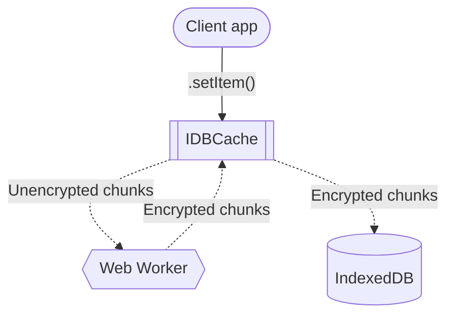
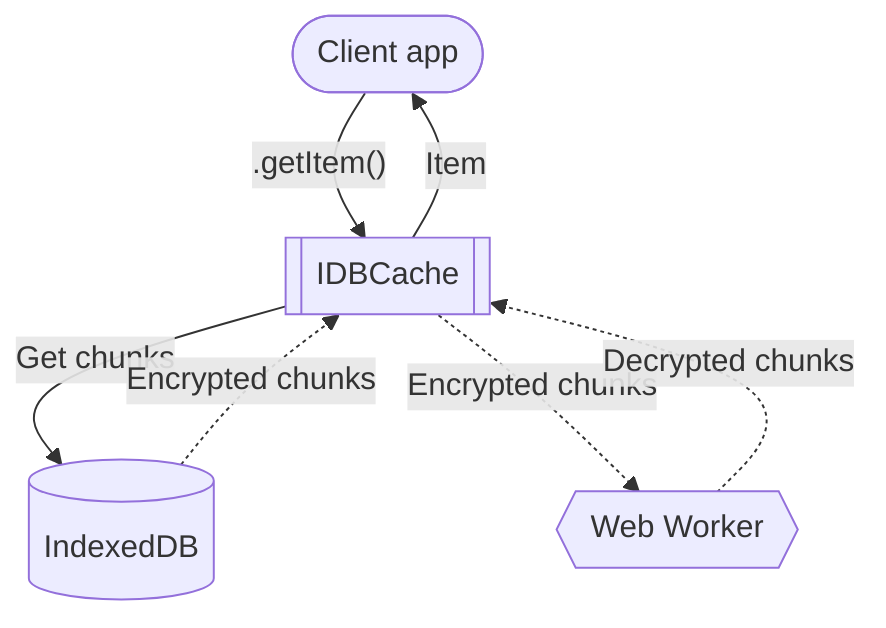

# idb-cache

IndexedDB-based caching library with encryption and chunked storage, designed for performance and security. Implements AsyncStorage interface.

```typescript
interface AsyncStorage {
  getItem: (key: string) => Promise<string | null>;
  setItem: (key: string, value: string) => Promise<unknown>;
  removeItem: (key: string) => Promise<void>;
  clear: () => Promise<void>;
}
```

## Why encrypt data in IndexedDB?

Encryption keeps data in IndexedDB private, even when a browser profile is shared on the same device. Only one with access to the `cacheKey` can decrypt the data.

## Installation

```bash
npm install @instructure/idb-cache
```

## Usage

```typescript
import { IDBCache } from '@instructure/idb-cache';

// Initialize the cache
const cache = new IDBCache({
  cacheKey: 'your-secure-key',
  cacheBuster: 'unique-cache-buster',
  // chunkSize?: number;
  // cleanupInterval?: number;
  // dbName?: string;
  // debug?: boolean,
  // gcTime?: number;
  // maxTotalChunks?: number
  // pbkdf2Iterations?: number;
  // priority?: "normal" | "low"
});

// Store an item
await cache.setItem('key', 'value');

// Retrieve an item
const token = await cache.getItem('key');
console.log(token); // Outputs: 'value'

// Remove an item
await cache.removeItem('key');

// Count stored chunks
const totalChunks = await cache.count();

// Removes expired items, busted items, and limits chunks
// Runs at interval
await cache.cleanup();

// Clears all items from cache
await cache.clear();

// Destroy the cache instance
await cache.destroy();
```

## Features

- **Web Worker**: Offloads encryption and decryption tasks to prevent blocking the main thread.
- **Chunking**: Efficiently handles large data by splitting it into chunks.
- **Encryption**: Secures data using AES-GCM with PBKDF2 key derivation.
- **Garbage collection**: Expires and cleans up outdated cache entries.
- **Task processing**: Uses parallelism and queue to mitigate crypto/CPU overload.

## Usage with TanStack Query

Integrate idb-cache as an AsyncStorage persister for TanStack Query.

```typescript
import { QueryClient } from '@tanstack/query-core';
import { experimental_createPersister as createPersister } from '@tanstack/query-persist-client-core';
import { IDBCache } from '@instructure/idb-cache';

const idbCache = new IDBCache({
  cacheKey: 'user_cache_key',
});

const persister = createPersister({
  storage: idbCache,
  maxAge: 1000 * 60 * 60 * 24 * 7, // 7 days
});

export const queryClient = new QueryClient({
  defaultOptions: {
    queries: {
      staleTime: 1000 * 60 * 60, // 1 hour
      gcTime: 1000 * 60 * 60 * 24 * 7, // 7 days
      persister,
    },
  },
});


```

## Data flow

### setItem



### getItem



## Technologies used

- [IndexedDB](https://developer.mozilla.org/en-US/docs/Web/API/IndexedDB_API)
- [Web Workers](https://developer.mozilla.org/en-US/docs/Web/API/Web_Workers_API)
  - [SharedWorker](https://developer.mozilla.org/en-US/docs/Web/API/SharedWorker)
  - [MessageChannel](https://developer.mozilla.org/en-US/docs/Web/API/MessageChannel)
  - [MessagePort](https://developer.mozilla.org/en-US/docs/Web/API/MessagePort)
  - [Transferable objects](https://developer.mozilla.org/en-US/docs/Web/API/Web_Workers_API/Transferable_objects)
- [Web Crypto API](https://developer.mozilla.org/en-US/docs/Web/API/Web_Crypto_API)
  - [SubtleCrypto](https://developer.mozilla.org/en-US/docs/Web/API/SubtleCrypto)
  - [AES-GCM](https://developer.mozilla.org/en-US/docs/Web/API/AesGcmParams)
  - [PBKDF2](https://developer.mozilla.org/en-US/docs/Web/API/Pbkdf2Params)
- [ArrayBuffer](https://developer.mozilla.org/en-US/docs/Web/JavaScript/Reference/Global_Objects/ArrayBuffer)

## Related reading

- [Is postMessage slow?](https://surma.dev/things/is-postmessage-slow/)
- [Measure performance with the RAIL model](https://web.dev/articles/rail)
- [LocalStorage vs. IndexedDB vs. Cookies vs. OPFS vs. WASM-SQLite](https://rxdb.info/articles/localstorage-indexeddb-cookies-opfs-sqlite-wasm.html)